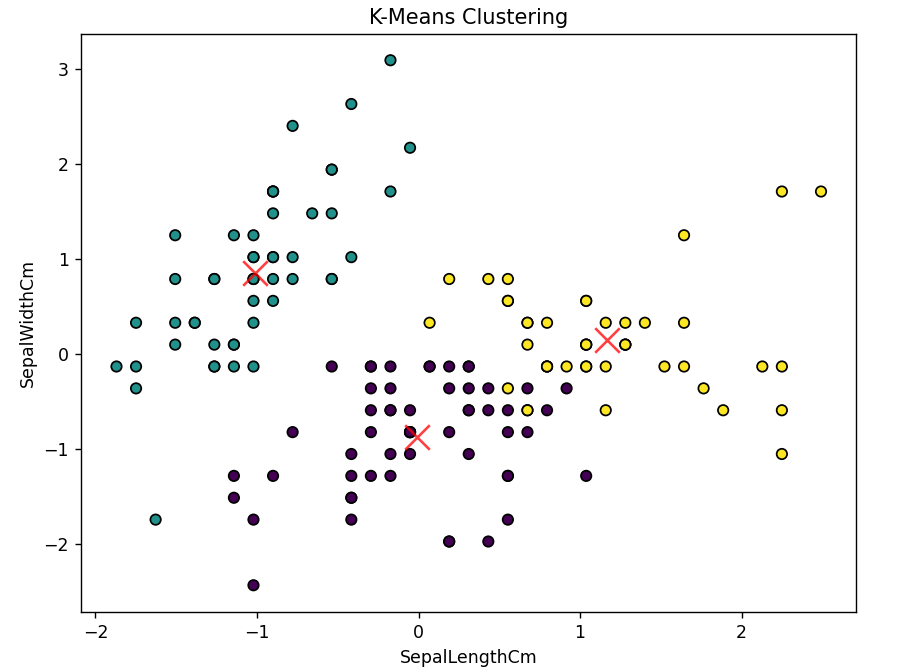

# **K-Means Clustering Model**

This project implements a simple K-Means Clustering algorithm using Python and applies it to the Iris dataset from Scikit-learn. The model is built without using any machine learning libraries for the K-means algorithm itself, providing an educational insight into how K-means clustering works under the hood.

## **Table of Contents**
- [What is K-Means Clustering?](#what-is-k-means-clustering)
- [K-Means Algorithm](#k-means-algorithm)
- [Cost Function](#cost-function)
- [How It Works](#how-it-works)
- [Installation](#installation)
- [Project Structure](#project-structure)
- [Usage](#usage)
- [Example Output](#example-output)

## **What is K-Means Clustering?**
K-means clustering is an iterative algorithm that partitions a dataset into `k` clusters, where each data point belongs to the cluster with the nearest mean. It is a type of unsupervised learning algorithm used for clustering data into groups based on similarity.

## **K-Means Algorithm**
The K-means algorithm follows these main steps:
1. **Initialization**: Select `k` initial centroids randomly from the dataset.
2. **Assignment**: Assign each data point to the nearest centroid to form `k` clusters.
3. **Update**: Calculate new centroids as the mean of the data points in each cluster.
4. **Repeat**: Repeat the assignment and update steps until the centroids no longer change or a specified number of iterations is reached.

<div align="center">
	
</div>

## **Cost Function**
The cost function used in K-means clustering is the sum of squared distances between data points and their respective cluster centroids. It measures the compactness of the clusters, with a lower cost indicating tighter clusters.

<div align="center">
	
</div>

where:
- `w_ik = 0` if the data point does not belong to the cluster
- `w_ik = 1` if the data point belongs to the cluster
- `x_i` is the position of a given point in the dataset
- `c_k` is the centroid of the cluster

## **How It Works?**
1. **Data Preparation**: 
   - The Iris dataset from Scikit-learn is used. Features are standardized to have zero mean and unit variance.

2. **Model Implementation**: 
   - A K-means clustering model is implemented from scratch using NumPy.
   - The model uses an iterative process to update cluster centroids and assign data points to clusters.

3. **Model Training and Evaluation**: 
   - The model is trained on the dataset.
   - The performance is evaluated by mapping cluster labels to true labels and calculating accuracy.

## **Installation**
To run this project, you need Python 3 installed. You'll also need to install a few dependencies. You can install them using `pip`:

```bash
pip install numpy scikit-learn
```

## **Project Structure**
```
.
├── README.md                    # Project documentation
├── KMeansClustering.py          # Implementation of the K-Means Clustering algorithm from scratch
└── implement.py                 # Main script to load data, train the model, and evaluate it
```
- `KMeansClustering.py`: Contains the `KMeans` class with methods to fit the model, predict clusters, and calculate the cost.
- `implement.py`: Loads the Iris dataset, standardizes the data, fits the K-means model, and evaluates its performance.

## **Usage**
1. Clone the repository:
```bash
git clone https://github.com/darsh0820/Machine-Learning-Models.git
cd Machine-Learning-Models
cd K-means-Clustering
```

2. Run the project:
```bash
python implement.py
```
This will train the Logistic Regression model on the Breast Cancer dataset and evaluate its performance.

## **Example Output**
After running `implement.py`, you should see output similar to:<br>
<div align="center">
    
</div>