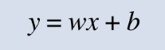
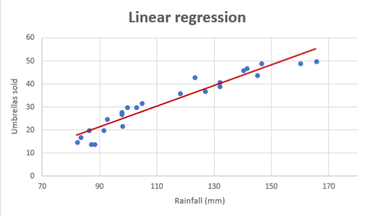
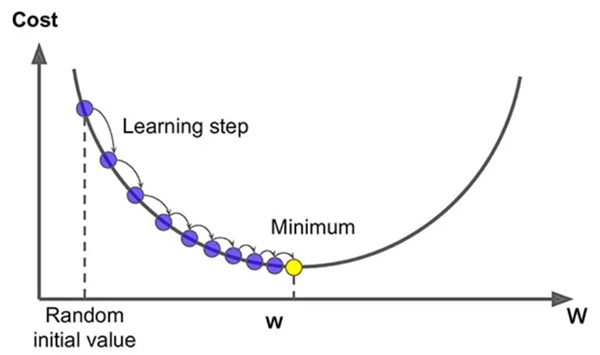
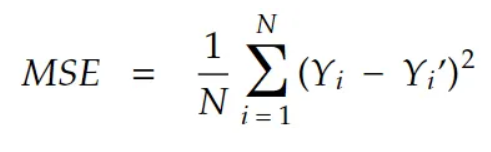
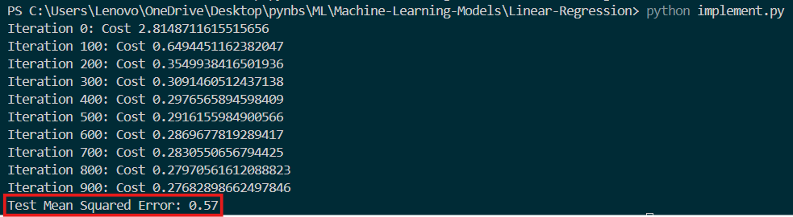

# **Linear Regression Model**
This project implements a simple Linear Regression model using Python and applies it to the California Housing dataset. The model is built without using any machine learning libraries for the linear regression algorithm itself, providing an educational insight into how linear regression works under the hood.

## **Table of Contents**
- [What is Linear Regression?](#what-is-linear-regression)
- [Linear Regression Function](#linear-regression-function)
- [Gradient Descent](#gradient-descent)
- [Cost Function](#cost-function)
- [How It Works](#how-it-works)
- [Installation](#installation)
- [Project Structure](#project-structure)
- [Usage](#usage)
- [Example Output](#example-output)

## **What is Linear Regression?**
Linear regression is a statistical method used to model the relationship between a dependent variable and one or more independent variables. It assumes a linear relationship between the input variables (X) and the output variable (y). The goal is to find the best-fitting linear line through the data points.

## **Linear Regression Function**
In linear regression, the relationship between the input features and the target variable is modeled as:
<div align="center">
    
</div>
Where:
- `y` is the predicted output.
- `b` is the bias (intercept).
- `w` values are the model's learned weights.
- `x` values are the feature values for a particular example.

If you plot this linear regression equation, you will get a straight line as shown below.
<div align="center">
    
</div>

## **Gradient Descent**
Gradient descent is an optimization algorithm used to minimize the cost function in linear regression. The general idea of gradient descent is to iteratively adjust the weights to find the best-fit line that minimizes the error (cost) between the predicted and actual values.

<div align="center">
    
</div>

## **Cost Function**
The cost function measures the performance of a linear regression model by calculating the difference between the predicted values and the actual values. The most commonly used cost function for linear regression is the Mean Squared Error (MSE), defined as:
<div align="center">
    
</div>
Where:
- `N` is the number of training examples.
- `y'` is the predicted value for the input `x`.
- `y` is the actual output.

## **How It Works?**
1. **Data Preparation:**  
   The California Housing dataset is used. Features are standardized to have zero mean and unit variance.

2. **Model Implementation:**  
   A linear regression model is implemented from scratch using NumPy. The model uses gradient descent to optimize the weights.

3. **Model Training and Evaluation:**  
   The model is trained on the training set. The performance is evaluated on the test set using metrics such as Mean Squared Error.

## **Installation**
To run this project, you need Python 3 installed. You'll also need to install a few dependencies. You can install them using `pip`:

```bash
pip install numpy scikit-learn
```
## **Project Structure**
```
.
├── README.md                    # Project documentation
├── LinearRegression.py          # Implementation of the Linear Regression model from scratch
└── implement.py                 # Main script to load data, train the model, and evaluate it
```
- `LinearRegression.py`: Contains the `LinearRegression` class with methods to train and predict using linear regression.
- `implement.py`: Loads the California Housing dataset, standardizes the data, splits it into training and testing sets, and trains/evaluates the linear regression model.

## **Usage**
1. Clone the repository:
```bash
git clone https://github.com/darsh0820/Machine-Learning-Models.git
cd Machine-Learning-Models
cd Linear-Regression
```

2. Run the project:
```bash
python implement.py
```
This will train the Linear Regression model on the California Housing dataset and evaluate its performance.

## **Output**
After running `implement.py`, you should see output similar to:<br>
<div align="center">
    
</div>
<!--  -->
