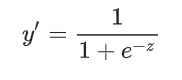
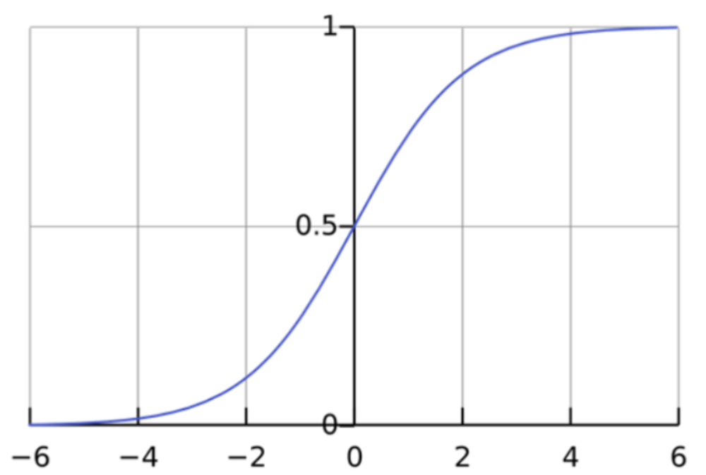
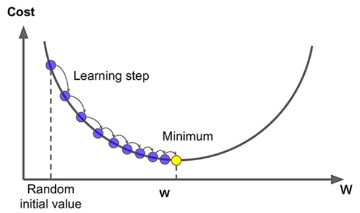
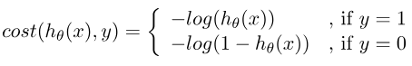
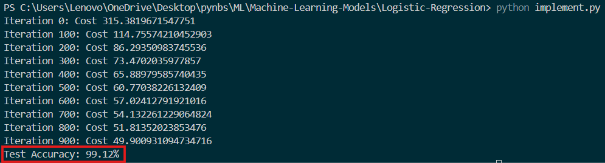

# **Logistic Regression model from scratch**
This project implements a simple Logistic Regression model from scratch using Python and applies it to the Breast Cancer dataset from Scikit-learn. The model is built without using any machine learning libraries for the logistic regression algorithm itself, providing an educational insight into how logistic regression works under the hood.

## **Table of Contents**
- [What is Logistic Regression?](#what-is-logistic-regression)
- [Logistic Regression Function](#logistic-regression-function)
- [Gradient Descent](#gradient-descent)
- [Cost Function](#cost-function)
- [How It Works](#how-it-works)
- [Installation](#installation)
- [Project Structure](#project-structure)
- [Usage](#usage)
- [Example Output](#example-output)

## **What is Logistic Regression?**
Logistic regression is a data analysis technique that uses mathematics to find the relationships between two data factors. It then uses this relationship to predict the value of one of those factors based on the other. The prediction usually has a finite number of outcomes, like yes or no.

## **Logistic Regression Function**
Logistic regression is a statistical model that uses the logistic function, or logit function, in mathematics as the equation between x and y. The logit function maps y as a sigmoid function of x.
<div align="center">
	
</div>
<!--  -->

where:
- `y'` is the output of the logistic regression model for a particular example.
- `z = b + w1x1 + w2x2 + .... + wnxn`
    - The `w` values are the model's learned weights, and `b` is the bias.
    - The `x` values are the feature values for a particular example.
If you plot this logistic regression equation, you will get an S-curve as shown below.
<div align="center">
	
</div>
<!--  -->

## **Gradient Descent**
Unlike linear regression, which has a closed-form solution, gradient decent is applied in logistic regression. The general idea of gradient descent is to tweak parameters w and b iteratively to minimize a cost function.
<div align="center">
	
</div>
<!--  -->

## **Cost Function**
The cost function summarizes how well the model is behaving. In other words, we use the cost function to measure how close the model’s predictions are to the actual outputs.<br>
In linear regression, we use mean squared error (MSE) as the cost function. But in logistic regression, using the mean of the squared differences between actual and predicted outcomes as the cost function might give a wavy, non-convex solution; containing many local optima.
So, we use a logarithmic function to represent the cost of logistic regression. It is guaranteed to be convex for all input values, containing only one minimum, allowing us to run the gradient descent algorithm.<br>
When dealing with a binary classification problem, the logarithmic cost of error depends on the value of y. We can define the cost for two cases separately:
<div align="center">
	
</div>
<!--  -->

## **How It Works?**
1. Data Preparation-  
The Breast Cancer dataset from Scikit-learn is used. Features are standardized to have zero mean and unit variance.
2. Model Implementation-  
A logistic regression model is implemented from scratch using NumPy.
The model uses gradient descent to optimize the weights.
3. Model Training and Evaluation-  
The model is trained on the training set.
The performance is evaluated on the test set, with accuracy as the main metric.

## **Installation**
To run this project, you need Python 3 installed. You'll also need to install a few dependencies. You can install them using `pip`:

```bash
pip install numpy scikit-learn
```

## **Project Structure**
```
.
├── README.md                    # Project documentation
├── LogisticRegression.py        # Implementation of the Logistic Regression model from scratch
└── implement.py                 # Main script to load data, train the model, and evaluate it
```
- `LogisticRegression.py`: Contains the `LogisticRegression` class with methods to train and predict using logistic regression.
- `implement.py`: Loads the Breast Cancer dataset, standardizes the data, splits it into training and testing sets, and trains/evaluates the logistic regression model.

## **Usage**
1. Clone the repository:
```bash
git clone https://github.com/darsh0820/Machine-Learning-Models.git
cd Machine-Learning-Models
cd Logistic-Regression
```

2. Run the project:
```bash
python implement.py
```
This will train the Logistic Regression model on the Breast Cancer dataset and evaluate its performance.

## **Output**
After running `implement.py`, you should see output similar to:<br>
<div align="center">
	
</div>
<!--  -->
